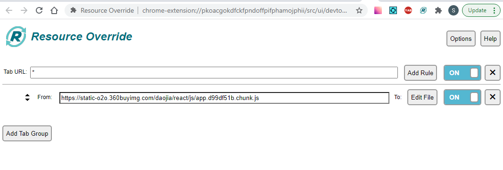
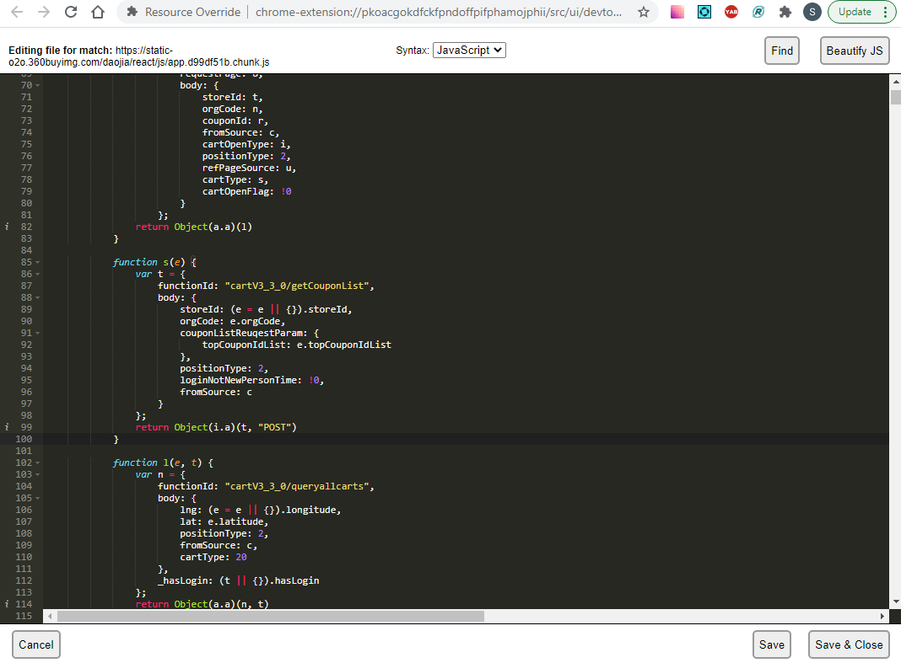
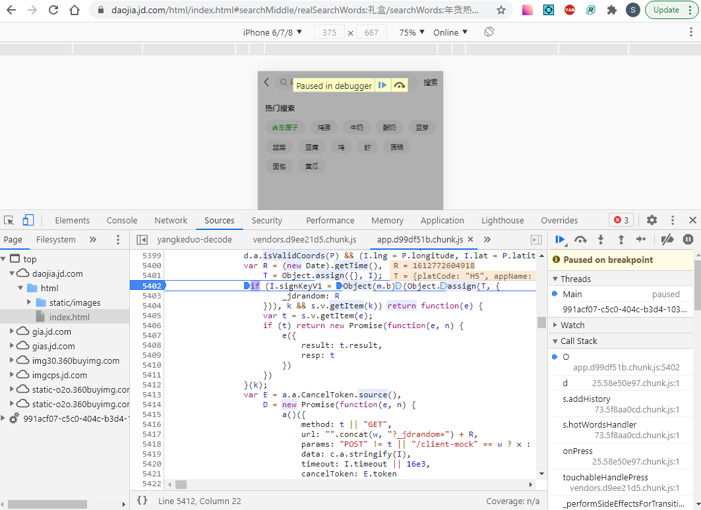
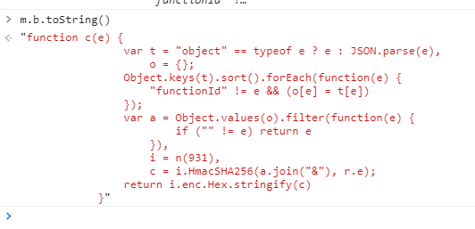
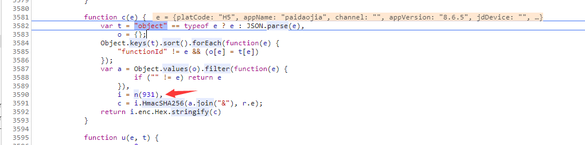
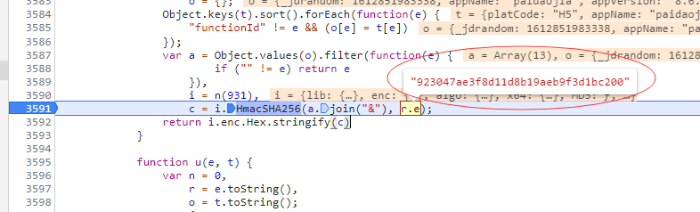

# JDDJ_Reverse

## Background
京东到家API URL很容易通过Fiddler或其它类似流量代理程序抓到，但是每个URL中包含了一个动态的自签名参数signKeyV1
下面是逆向分析原理和c#源代码模拟产生signKeyV1.

## Tools
京东到家web版signKeyV1逆向分析
分析工具： Chrome, <a href="https://chrome.google.com/webstore/detail/resource-override/pkoacgokdfckfpndoffpifphamojphii">Resource override extension</href>

## Resource override
Searching the keyword 'signKeyV1' , converting the obfuscated js content  by clicking on 'Beautify JS' button



## Decodes the function o generate 'signKeyV1'
Enable the option - "mobile device"(inspector tool > Toggle device toolbar) to access JDDJ home page, then break point at signKeyV1 
Where has the main function to generate the sign key:
```
Object(m.b)(Object.assign(T, {
                      _jdrandom: R
                  }))
```

Now you can easily convert the 'm.b' to actual function codes, alternatively, you can step in to the function m.b 



```
function c(e) {
    var t = "object" == typeof e ? e : JSON.parse(e),
        o = {};
    Object.keys(t).sort().forEach(function(e) {
        "functionId" != e && (o[e] = t[e])
    });
    var a = Object.values(o).filter(function(e) {
            if ("" != e) return e
        }),
        i = n(931),
        c = i.HmacSHA256(a.join("&"), r.e);
    return i.enc.Hex.stringify(c)
}
```
What the code lines do is:

- The each of parameters in URL will be sorted by parementer name - alphabetic

- Populates an array of those parameter values.

- Getting a string by concatenating all sorted parameter values in the array with '&' separator.

- Generating a hash value to the string using HmacSHA256

### Note: when generating the hash value, it attaches a fixed salt value - 923047ae3f8d11d8b19aeb9f3d1bc200 


So you won't need to step into the actual codes how to generate the hash value, 
instead, you can develop yourself function using any programming language to simulate what this javascript function does.

## The codes / function written in C# to generate the hash value
As mentioned before, those parameters in URL should be sorted by parameter name, 
Here let me show you how to sort the parameters and populates a string by concatenating all sorted parameter values.
```
using System.Linq;

string p = "_jdrandom=1612850512250&appName=paidaojia&appVersion=8.6.5&body=%7B%22refPageSource%22:%22newChannelPage%22,%22city%22:%22%E5%AE%89%E9%98%B3%E5%B8%82%22,%22areaCode%22:468,%22longitude%22:114.35015,%22latitude%22:36.105495,%22coordType%22:%222%22,%22address%22:%22%22,%22channelId%22:%224053%22,%22currentPage%22:1,%22pageSize%22:10,%22rankType%22:0,%22lastStoreId%22:%22%22,%22filterTagIds%22:%22%22,%22slideStoreList%22:false,%22venderIndustryType%22:[],%22sortType%22:%22%22,%22level%22:[],%22activityId%22:%22%22,%22newChannelFlag%22:%221%22,%22channelBusiness%22:%2210%22,%22pageSource%22:%22channelStorePage%22,%22ref%22:%22channel%22,%22ctp%22:%22moreStoreList%22%7D&channel=&city_id=468&deviceId=H5_DEV_164A38A8-143E-4C17-AC29-90F187C9FCF4&functionId=zone%2FrecommendStoreList&globalPlat=2&jda=122270672.1612491306560516543669.1612491307.1612745403.1612764992.4&jdDevice=&lat=36.105495&lng=114.35015&platCode=H5&poi=&traceId=H5_DEV_164A38A8-143E-4C17-AC29-90F187C9FCF41612766708154";
string [] a = p.Split("&".ToCharArray());
IOrderedEnumerable<string> a1 = a.OrderBy(item => item.Split("=".ToCharArray())[0]);
a = a1.ToArray(); // Sorting parameters by ascending 
string [] b = new string[a.Length];
int idx = 0;
```
// Taking the non-empty value into a new array (note: excluding the parameter - 'functionId')
```
for (int i = 0; i < a.Length; i++)
{
  string [] c = a[i].Split("=".ToCharArray());
  if (c.Length < 2 || c[1].Length == 0 || c[0] == "functionId") continue;
  b[idx++] = Uri.UnescapeDataString(c[1]);
}
```
// Now you get the final parameter values with '&' separator, it will be passed the 'GetHash' function to generate the hash value. (see below)
```
string s = String.Join("&", b.Take(idx));
string k = "923047ae3f8d11d8b19aeb9f3d1bc200";
string h = GetHash(s, k);
```

C# provided a way to make the hash value easily, I found an existing function to do that.
```
//https://stackoverflow.com/questions/47686677/how-to-generate-hmac-sha256-in-net-core
using System.Security.Cryptography;
public static String GetHash(String text, String key)
{
    // change according to your needs, an UTF8Encoding
    // could be more suitable in certain situations
    System.Text.UTF8Encoding encoding = new System.Text.UTF8Encoding();

    Byte[] textBytes = encoding.GetBytes(text);
    Byte[] keyBytes = encoding.GetBytes(key);

    Byte[] hashBytes;

    using (HMACSHA256 hash = new HMACSHA256(keyBytes))
        hashBytes = hash.ComputeHash(textBytes);

    return BitConverter.ToString(hashBytes).Replace("-", "").ToLower();
}
```

## END
